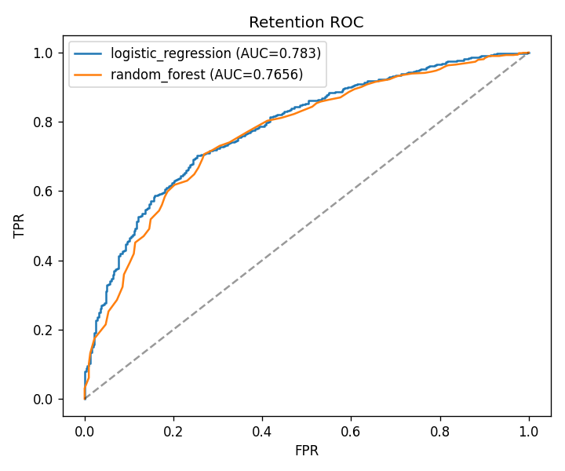
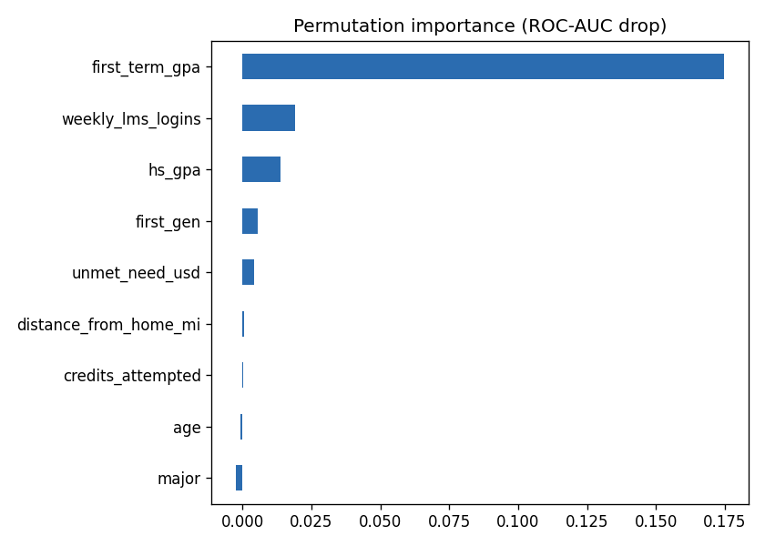
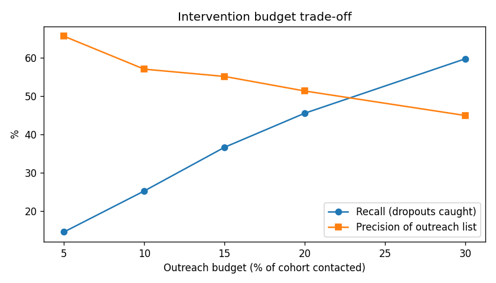
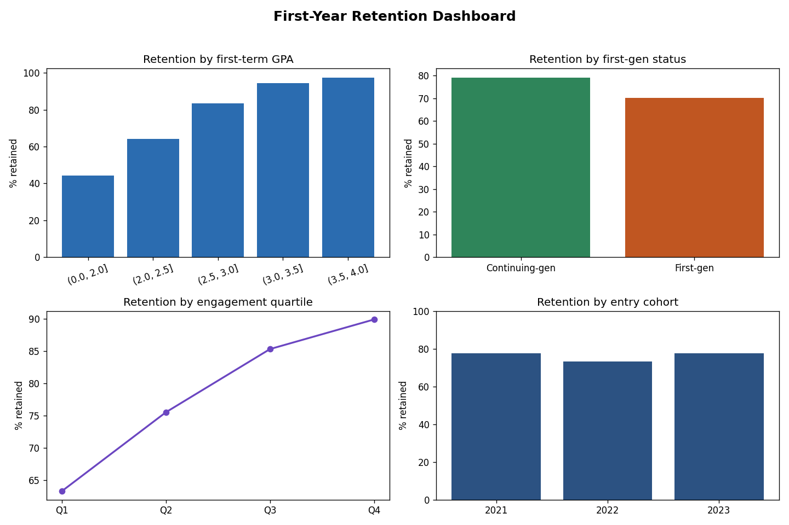

# 🎓 Student Success & Retention Analytics

An **early-alert system** for first-year student retention: SQL segment analytics plus a tuned ML model that ranks students by dropout risk — with an **intervention-budget analysis** and a **fairness check** so an advising team can act on it responsibly.

[](https://github.com/danielduongg/student-success-analytics/actions)

> **Reproducible by design** via a synthetic cohort whose retention is driven by the factors that genuinely predict it (prior GPA, engagement, financial need, first-gen status, course load). Swap in the public UCI *Student Performance* dataset to go live.

## What makes it more than a toy

- **Hyperparameter search** — `RandomizedSearchCV` (cross-validated) over a class-weighted Random Forest, compared against a logistic baseline.
- **Intervention-budget analysis** — advisors can't call everyone, so we report **precision/recall@K**: if you contact the top *K%* riskiest students, how many real dropouts do you catch?
- **Fairness check** — dropout-recall parity across first-generation status at a fixed outreach budget.
- **Permutation importance**, an **inference CLI** (`predict.py`), **pytest**, **GitHub Actions CI**, **Dockerfile**, logging.

## Results (holdout 2023 cohort — trained on 2021–22)

| Model | ROC-AUC | PR-AUC (dropout) |
|---|---|---|
| Logistic Regression | **0.783** | 0.513 |
| Random Forest (tuned) | 0.766 | 0.472 |




## Intervention budget: who do we call first?

Advisors have limited time. This curve turns the risk score into an operational plan:

| Outreach budget | Students contacted | Precision | Recall (dropouts caught) |
|---|---|---|---|
| Top 5% | 70 | 0.66 | 15% |
| Top 15% | 210 | 0.55 | 37% |
| Top 20% | 280 | 0.51 | 46% |
| Top 30% | 420 | 0.45 | 60% |



Contacting the riskiest **20%** of the cohort reaches **46% of all future dropouts** at ~51% precision — a concrete, defensible starting point for a pilot.

## Fairness check
At a 20% outreach budget, dropout-recall is **0.56 for first-gen** vs **0.39 for continuing-gen** students. The model surfaces higher-need students at a *higher* rate — beneficial for a support intervention, but the kind of disparity you should measure and monitor, not discover later.

## Retention dashboard


Engagement is the standout lever: retention climbs from ~60% to ~89% across LMS-login quartiles.

## Quickstart
```bash
pip install -r requirements.txt
python main.py                 # generate cohort, run SQL analytics, train model
python main.py --no-tune       # faster (skip hyperparameter search)
python predict.py --hs-gpa 2.4 --first-term-gpa 1.8 --lms 2 --unmet-need 9000 --first-gen 1
pytest -q
```
`reports/at_risk_students.csv` is the advisor-ready, ranked outreach list.

## Tech
Python · scikit-learn · DuckDB (in-memory SQL) · pandas · matplotlib · pytest · Docker · GitHub Actions

## Layout
```
├── generate_data.py     # realistic synthetic cohort
├── analytics.py         # SQL segment analytics + dashboard
├── model.py             # tuning, budget curve, fairness, importance
├── predict.py           # score a single student
├── main.py              # orchestrator
├── analytics_queries.sql
├── test_*.py            # pytest suite
└── .github/workflows/ci.yml
```
